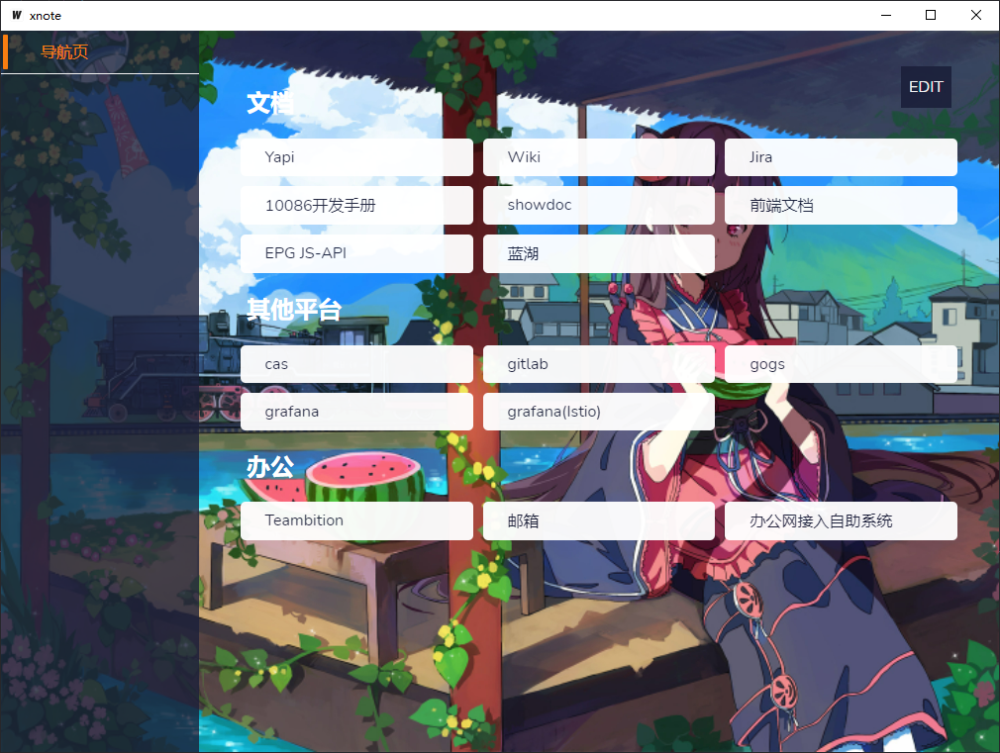
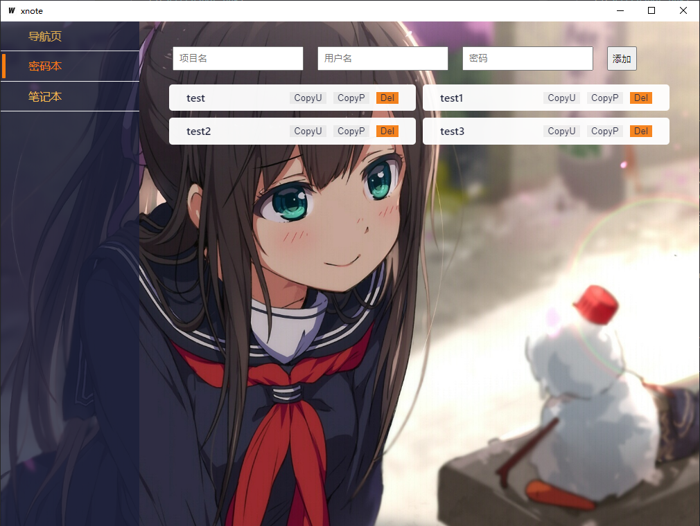
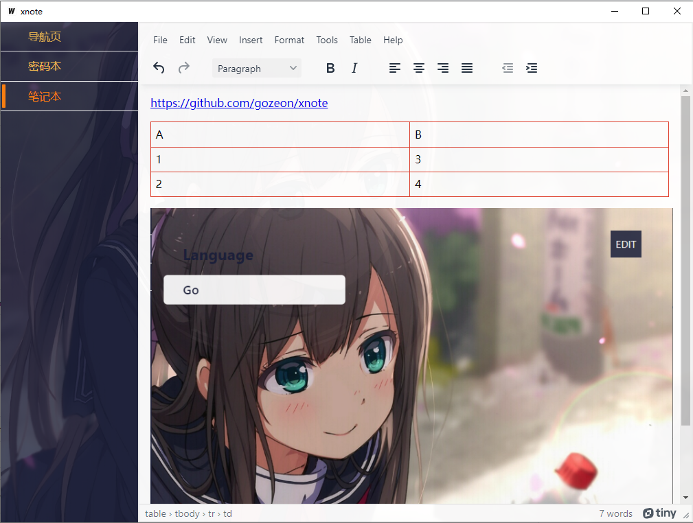

# xnote

  

  

  

## TODO

- [x] 导航栏
- [x] 密码本
- [x] 笔记本
- [ ] 决策树

> 暂时使用json文件进行持续化数据操作，数据格式可参考 `sample/` 文件夹

## Live Development

To run in live development mode, run `wails dev` in the project directory. In another terminal, go into the `frontend`
directory and run `npm run dev`. The frontend dev server will run on http://localhost:34115. Connect to this in your
browser and connect to your application.

## Building

To build a redistributable, production mode package, use `wails build`.

## issure

- https://github.com/wailsapp/wails/issues/1504
